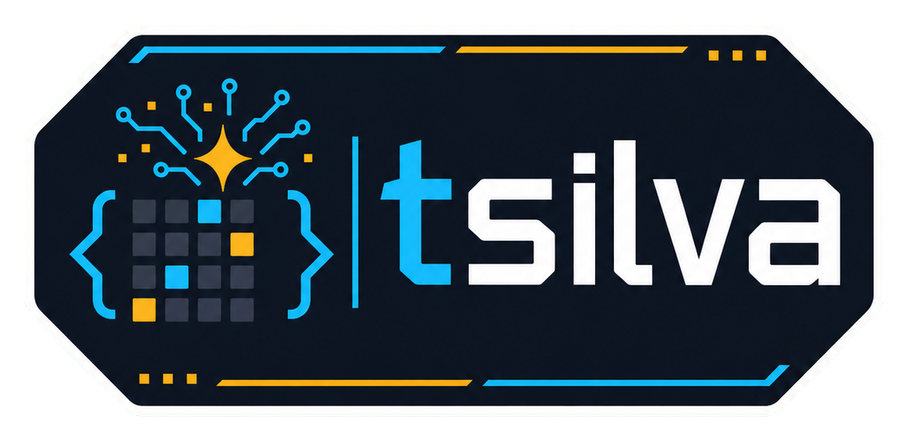

  

  **👋 20+ years shipping software — Microsoft, Hive Solutions, Tynker, and now exploring AI/ML 🤖**

With **60+ projects shipped**, my passion for tech began in early childhood, playing around with a [Sinclair ZX Spectrum 48k](https://www.youtube.com/watch?v=V0EfycbDhiw). My career includes key roles at [Microsoft](https://cv.tsilva.eu/#-microsoft) 💻, co-founding [Hive Solutions](https://cv.tsilva.eu/#-hive-solutions) 🐝, and leading development at [Tynker](https://cv.tsilva.eu/#-tynker) 💡, where I played a key role in creating products that were used by over **100 million students across 150,000+ schools** 🏫, significantly contributing to its **[$200 million acquisition by BYJU's](https://techcrunch.com/2021/09/16/byjus-acquires-coding-platform-tynker-for-200-million-in-us-expansion-push/)** 💼. I work across Frontend 👨‍💻, Backend ⚙️, Mobile 📱, always striving to improve my knowledge and skills. Lately I've been having fun with [deeply learning](https://github.com/tsilva/aiml-notebooks) how Deep Learning 🤖 learns deeply (🥁Ba-dum-tss!😄).

You can find out more about me and my work here:

&nbsp;&nbsp;&nbsp;&nbsp;
&nbsp;&nbsp;&nbsp;&nbsp;
&nbsp;&nbsp;&nbsp;&nbsp;
&nbsp;&nbsp;&nbsp;&nbsp;
&nbsp;&nbsp;&nbsp;&nbsp;

